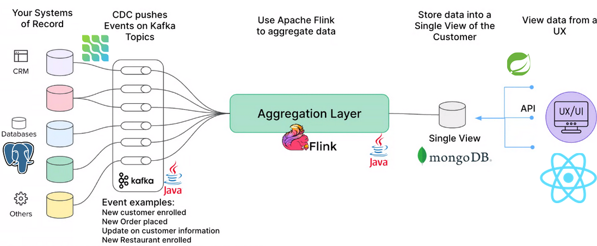

# Architecture of FlinkFood

This file is meant to give future developers an overview of how the FlinkFood application is architectured.

## General overview


The document will go through each of these parts and explain how each part works. For more detailed explainations please refer to the code. First of all we will go through how all of the parts are orchestrated.

## Orchestration - Through Docker Compose
Docker compose is used to orchestrate the entire project. We esentially have containers for each part of the general overview. Please refer to the [docker-compose.yml](../docker-compose.yml) file for more information.

### Dockerfile.flink - A customized Docker container for the flink jobs.
This file essentially sets up the dependencies needed for the project to compile. Then it compiles the project using maven. In the end it runs the [flink_start.sh](../flink_start.sh) file. This file essentially waits for the system to be fully ready (kafka topics is up and running), since the Flinkjobs depend on them. Then it submits each flink job to the Flink engine. 


## System of records
This is implemented as a PostgreSQL database, where each tableis a seperate "system of record". These are then connected to the CDC

## CDC
The CDC is implemented by using Debezium. It listens to changes in the PostgreSQL tables and then publishes these changes tothe kafka topics. The CDC is the part that is initizializing the Kafka topics. This is done in the flink_start.sh script mentioned earlier.

## Kafka Topics
The project has a seperate Kafka topic for each table. 

## Aggregation Layer
The aggregation layer is implemented using Apache Flink. It is divided into three different modules, each with their own pom.xml file. These modules correspond to the three different single views created. These three modules all have the same parent module. Calling
```bash
mvn clean install
```
On this parent module will compile the entire project. Since we have three child modules, this will create one .jar file for each job. This is required for submitting jobs to the FlinkEngine as it is recommended to have one .jar file for each job. In each job the Flink SQL methodology of creating jobs has been used.

The Flink Engine has capabilities to directly connect to MongoDB as a sink, hence there is a direct connection between the aggregation layer and the single view. There is no use of Kafka here.

## Single view
The single view is implemented in MongoDB. As mentioned it is directly connected to the Aggregation layer.

## API/Interface
This part of the project has not yet been implemented due to time constraints.
